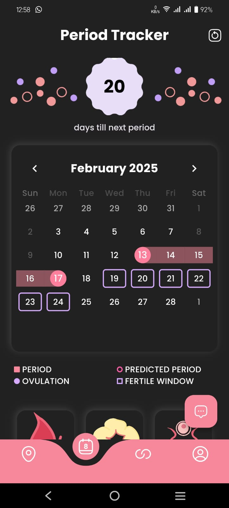
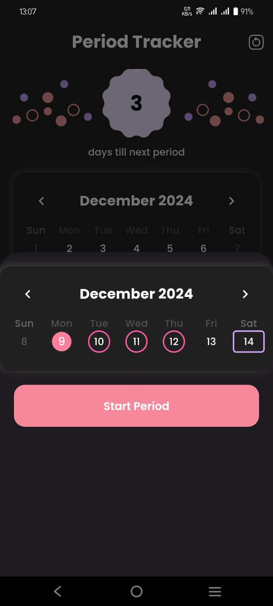
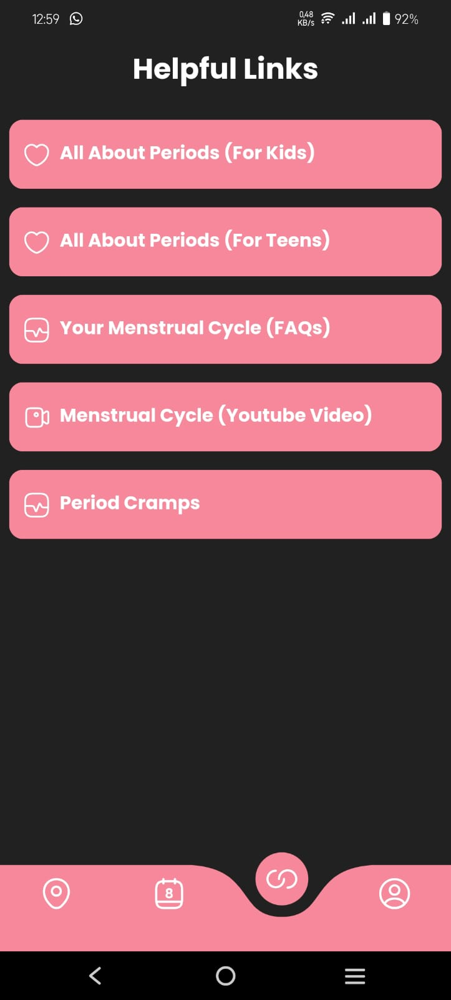
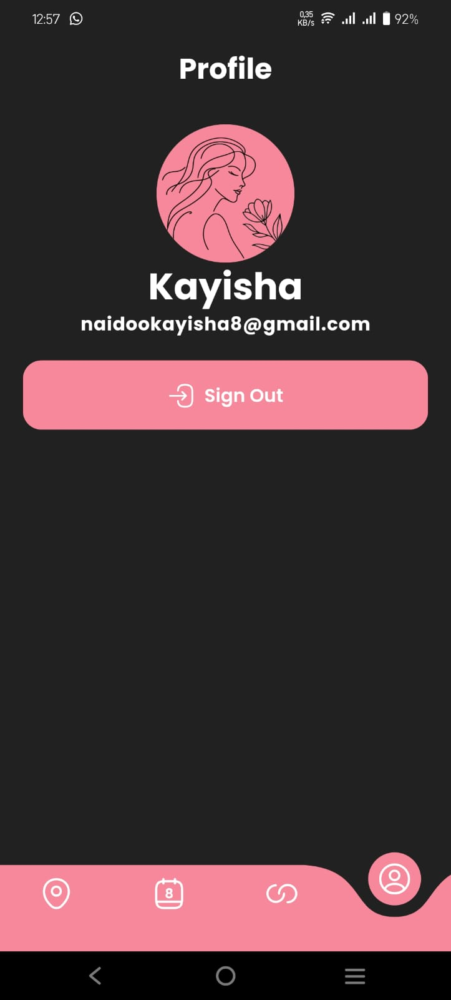

# Akai

- Developed during a weekend, for the Wits AWS Cloud-a-thon 2024. Development continued for a short while afterwards.

- A beautiful flutter application built to enhance the lives of female students
    - Allows requesting of pads to nearby users. Application automatically searches for users within a particular radious and alerts them. Automates much of the process to make things simple for users.
    - Built in AI Chatbot to answer any questions about womens health.
    - Advanced period tracking system.

# Technolody
- Frontend: Flutter
- Backend:
    - ExpressJS, Firebase, MongoDB, Azure Web Services

# Screenshots

  
  

  
  

<!-- 

 -->

